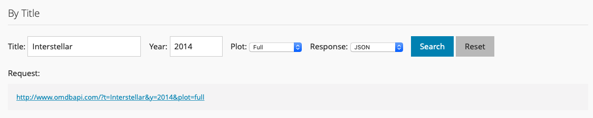
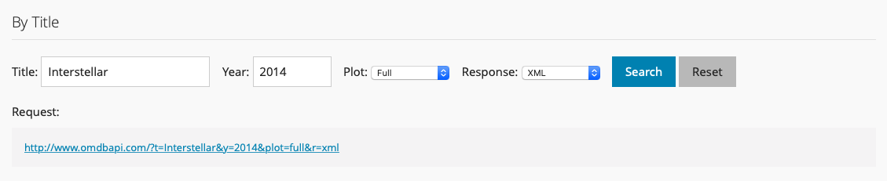

# DIY web data {#diy-web-data}

```{r include = FALSE}
source("common.R")
can_render <- Sys.getenv("OMDB_API_KEY", unset = "") != ""
knitr::opts_chunk$set(eval = can_render)
```

```{r eval = !can_render, echo = FALSE, comment = NA}
message("No OMDb key available. Code chunks will not be evaluated.")
```

<!--Original content: https://stat545.com/webdata03_activity.html-->
<!--Original author: Andrew MacDonald-->

## Interacting with an API

In Chapter \@ref(api-wrappers) we experimented with several packages that "wrapped" APIs.  That is, they handled the creation of the request and the formatting of the output. In this chapter we're going to look at (part of) what these functions were doing.

### Load the tidyverse

We will be using the functions from the [tidyverse][tidyverse-main-page] throughout this chapter, so go ahead and load tidyverse package now.

```{r message = FALSE, warning = FALSE}
library(tidyverse)
```

### Examine the structure of API requests using the Open Movie Database

First we're going to examine the structure of API requests via the [Open Movie Database](http://www.omdbapi.com/) (OMDb). OMDb is very similar to IMDb, except it has a nice, simple API. We can go to the website, input some search parameters, and obtain both the XML query and the response from it. 

<!--TODO: Will frequently get an "Error: Daily request limit reached" message when using the demo. Seems to be an issue on their end: https://github.com/omdbapi/OMDb-API/issues/124 Maybe remove this exercise from the chapter to avoid problems?-->

**Exercise:** determine the shape of an API request. Scroll down to the ["Examples" section](http://www.omdbapi.com/#examples) on the OMDb site and play around with the parameters. Take a look at the resulting API call and the query you get back.

If we enter the following parameters:

+ `title = Interstellar`, 
+ `year = 2014`, 
+ `plot = full`, 
+ `response = JSON`

Here is what we see:

```{r omdb-demo-json, echo = FALSE, fig.cap = "Example OMDb Query in JSON", out.width = "100%"}

```

The request URL is:

```http
http://www.omdbapi.com/?t=Interstellar&y=2014&plot=full
```

Notice the pattern in the request. Let's try changing the response field from JSON to XML.

```{r omdb-demo-xml, echo = FALSE, fig.cap = "Example OMDb Query in XML", out.width = "100%"}

```

Now the request URL is:

```http
http://www.omdbapi.com/?t=Interstellar&y=2014&plot=full&r=xml
```

Try pasting these URLs into your browser. You should see this if you tried the first URL:

```JSON
{"Response":"False","Error":"No API key provided."}
```

...and this if you tried the second URL (where `r=xml`):

```XML
<root response="False">
  <error>No API key provided.</error>
</root>
```

### Create an OMDb API Key

This tells us that we need an API key to access the OMDb API. We will store our key for the OMDb API in our `.Renviron` file using the helper function `edit_r_environ()` from the [usethis][usethis-web] package. Follow these steps:

1. Visit this URL and request your free API key: <https://www.omdbapi.com/apikey.aspx>
1. Check your email and follow the instructions to activate your key.
1. Install/load the usethis package and run `edit_r_environ()` in the R Console:

    ```{r message = FALSE, warning = FALSE, eval = FALSE}
    # install.packages("usethis")
    library(usethis)
    edit_r_environ()
    ```

1. Add `OMDB_API_KEY=<your-secret-key>` on a new line, press enter to add a blank line at the end (important!), save the file, and close it. 
    + Note that we use `<your-secret-key>` as a placeholder here and throughout these instructions. Your actual API key will look something like: `p319s0aa` (no quotes or other characters like `<` or `>` should go on the right of the `=` sign).
1. Restart R.
1. You can now access your OMDb API key from the R console and save it as an object:
    ```{r fake-get-fake-key, eval = FALSE}
    Sys.getenv("OMDB_API_KEY")
    ```
    
    ```{r real-see-fake-key, echo = FALSE}
    Sys.getenv("OMDB_API_KEY_FAKE")
    ```
    
    
1. We can use this to easily add our API key to the request URL. Let's make this API key an object we can refer to as `movie_key`:

    ```{r}
    # save it as an object
    movie_key <- Sys.getenv("OMDB_API_KEY")
    ```
    
    ```{r save-fake-key, echo = FALSE}
    # save it as an object
    movie_key <- Sys.getenv("OMDB_API_KEY_FAKE")
    ```

#### Alternative strategy for keeping keys: `.Rprofile`

**Remember to protect your key! It is important for your privacy. You know, like a key.**

Now we follow the rOpenSci [tutorial on API keys](https://github.com/ropensci/rOpenSci/wiki/Installation-and-use-of-API-keys):

* ___Add `.Rprofile` to your `.gitignore` !!___
* Make a `.Rprofile` file ([windows tips](http://cran.r-project.org/bin/windows/rw-FAQ.html#What-are-HOME-and-working-directories_003f); [mac tips](http://cran.r-project.org/bin/macosx/RMacOSX-FAQ.html#The-R-Console)).
* Write the following in it:

```{r eval = FALSE}
options(OMBD_API_KEY = "YOUR_KEY")
```

* Restart R (i.e. reopen your RStudio project).

This code adds another element to the list of options, which you can see by calling `options()`. Part of the work done by `rplos::searchplos()` and friends is to go and obtain the value of this option with the function `getOption("OMBD_API_KEY")`.  This indicates two things: 

1. Spelling is important when you set the option in your `.Rprofile`
2. You can do a similar process for an arbitrary package or key. For example:

```{r eval = FALSE}
## in .Rprofile
options("this_is_my_key" = XXXX)
## later, in the R script:
key <- getOption("this_is_my_key")
```

This is a simple means to keep your keys private, especially if you are sharing the same authentication across several projects.


#### A few timely reminders about your `.Rprofile`

```r
print("This is Andrew's Rprofile and you can't have it!")
options(OMBD_API_KEY = "XXXXXXXXX")
```

* It must end with a blank line!
* It lives in the project's working directory, i.e. the location of your `.Rproj`.
* It must be gitignored.

Remember that using `.Rprofile` makes your code un-reproducible.  In this case, that is exactly what we want!  


### Recreate the request URL in R

How can we recreate the same request URLs in R? We could use the [`glue` package](https://glue.tidyverse.org/) to paste together the base URL, parameter labels, and parameter values:

```{r}
request <- glue::glue("http://www.omdbapi.com/?t=Interstellar&y=2014&plot=short&r=xml&apikey={movie_key}")
request
```

This works, but it only works for movie titled `Interstellar` from 2014 where we want the short plot and the XML format. Let's try to pull out more variables and paste them in with `glue`:

```{r}
glue::glue("http://www.omdbapi.com/?t={title}&y={year}&plot={plot}&r={format}&apikey={api_key}",
           title = "Interstellar",
           year = "2014",
           plot = "short",
           format = "xml",
           api_key = movie_key)
```

We could go even further and make this into a function called `omdb()` that we can reuse more easily.

```{r}
omdb <- function(title, year, plot, format, api_key) {
  glue::glue("http://www.omdbapi.com/?t={title}&y={year}&plot={plot}&r={format}&apikey={api_key}")
}
```

### Get data using the curl package


Now we have a handy function that returns the API query. We can paste in the link, but we can also obtain data from within R using the [curl][curl-cran] package. Install/load the curl package first.

```{r message = FALSE, warning = FALSE}
# install.packages("curl")
library(curl)
```

Using curl to get the data in XML format:
```{r fake-xml-req, eval = FALSE} 
request_xml <- omdb(title = "Interstellar", year = "2014", plot = "short", 
                    format = "xml", api_key = movie_key)

con <-  curl(request_xml)
answer_xml <- readLines(con, warn = FALSE)
close(con)
answer_xml
```

```{r real-xml-req, echo = FALSE}
request_xml <- omdb(title = "Interstellar", year = "2014", plot = "short", 
                    format = "xml", api_key = Sys.getenv("OMDB_API_KEY"))

con <- curl(request_xml)
answer_xml <- readLines(con, warn = FALSE)
close(con)
answer_xml
```


Using curl to get the data in JSON format:
```{r fake-json-req, eval = FALSE}
request_json <- omdb(title = "Interstellar", year = "2014", plot = "short", 
                     format = "json", api_key = movie_key)

con <- curl(request_json)
answer_json <- readLines(con, warn = FALSE)
close(con)
answer_json  
```

```{r real-json-req, echo = FALSE}
request_json <- omdb(title = "Interstellar", year = "2014", plot = "short", 
                     format = "json", api_key = Sys.getenv("OMDB_API_KEY"))

con <- curl(request_json)
answer_json <- readLines(con, warn = FALSE)
close(con)
answer_json  
```

We have two forms of data that are obviously structured. What are they?

## Intro to JSON and XML

<!--TODO: Add more to this section?-->

There are two common languages of web services: 

1. **J**ava**S**cript **O**bject **N**otation (JSON)
1. e**X**tensible **M**arkup **L**anguage (XML)

Here's an example of JSON (from [this wonderful site](https://zapier.com/learn/apis/chapter-3-data-formats/)):

```javascript
{
  "crust": "original",
  "toppings": ["cheese", "pepperoni", "garlic"],
  "status": "cooking",
  "customer": {
    "name": "Brian",
    "phone": "573-111-1111"
  }
}
```

And here is XML (also from [this site](https://zapier.com/learn/apis/chapter-3-data-formats/)):

```XML
<order>
    <crust>original</crust>
    <toppings>
        <topping>cheese</topping>
        <topping>pepperoni</topping>
        <topping>garlic</topping>
    </toppings>
    <status>cooking</status>
</order>
```

You can see that both of these data structures are quite easy to read. They are "self-describing". In other words, they tell you how they are meant to be read. There are easy means of taking these data types and creating R objects. 

### Parsing the JSON response with jsonlite

Our JSON response above can be parsed using `jsonlite::fromJSON()`. First install/load the jsonlite package.

```{r message = FALSE, warning = FALSE}
# install.packages("jsonlite")
library(jsonlite)
```

Parsing our JSON response with `fromJSON()`:
```{r}
answer_json %>% 
  fromJSON()
```

The output is a named list. A familiar and friendly R structure. Because data frames are lists and because this list has no nested lists-within-lists, we can coerce it very simply:

```{r}
answer_json %>% 
  fromJSON() %>% 
  as_tibble() %>% 
  glimpse()
```

### Parsing the XML response using xml2

We can use the [xml2][xml2-web] package to wrangle our XML response.

```{r message = FALSE, warning = FALSE}
# install.packages("xml2")
library(xml2)
```

Parsing our XML response with `read_xml()`:

```{r}
(xml_parsed <- read_xml(answer_xml))
```

Not exactly the result we were hoping for! However, this does tell us about the XML document's structure: 

* It has a `<root>` node, which has a single child node, `<movie>`. 
* The information we want is all stored as attributes (e.g. title, year, etc.).

The xml2 package has various functions to assist in navigating through XML. We can use the `xml_children()` function to extract all of the children nodes (i.e. the single child, `<movie>`):

```{r}
(contents <- xml_contents(xml_parsed))
```

The `xml_attrs()` function "retrieves all attribute values as a named character vector". Let's use this to extract the information that we want from the `<movie>` node:

```{r}
(attrs <- xml_attrs(contents)[[1]])
```

We can transform this named character vector into a data frame with the help of `dplyr::bind_rows()`:

```{r}
attrs %>% 
  bind_rows() %>% 
  glimpse()
```

## Introducing the easy way: httr

[httr][httr-web] is yet another star in the [tidyverse][tidyverse-main-page]. It is a package designed to facilitate all things HTTP from within R. This includes the major HTTP verbs, which are:

<!--TODO: Find source for these definitions-->
* __`GET()`__ - Fetch an existing resource. The URL contains all the necessary information the server needs to locate and return the resource.
* __`POST()`__ - Create a new resource. POST requests usually carry a payload that specifies the data for the new resource.
* __`PUT()`__ - Update an existing resource. The payload may contain the updated data for the resource.
* __`DELETE()`__ - Delete an existing resource.

<!--TODO: It's not clear in the original stat545 lesson what this is referring to. I checked the paragraphs above and below and wasn't able to find them at this site. Keeping the link here to revisit later.

(from [HTTP made really easy](http://www.jmarshall.com/easy/http/))
-->


HTTP is the foundation for APIs; understanding how it works is the key to interacting with all the diverse APIs out there. An excellent beginning resource for APIs (including HTTP basics) is [An Introduction to APIs](https://zapier.com/learn/apis/) by Brian Cooksey.

httr also facilitates a variety of ___authentication___ protocols.

httr contains one function for every HTTP verb. The functions have the same names as the verbs (e.g. `GET()`, `POST()`).  They have more informative outputs than simply using curl and come with nice convenience functions for working with the output:

```{r message = FALSE, warning = FALSE}
# install.packages("httr")
library(httr)
```

Using httr to get the data in JSON format:
```{r fake-httr-json, eval = FALSE}
request_json <- omdb(title = "Interstellar", year = "2014", plot = "short", 
                     format = "json", api_key = movie_key)
response_json <- GET(request_json)
content(response_json, as = "parsed", type = "application/json")
```

```{r real-httr-json, echo = FALSE, warning = FALSE}
request_json <- omdb(title = "Interstellar", year = "2014", plot = "short", 
                     format = "json", api_key = Sys.getenv("OMDB_API_KEY"))
response_json <- GET(request_json)
content(response_json, as = "parsed", type = "application/json")
```

Using httr to get the data in XML format:
```{r fake-httr-xml, eval = FALSE}
request_xml <- omdb(title = "Interstellar", year = "2014", plot = "short", 
                    format = "xml", api_key = movie_key)

response_xml <- GET(request_xml)
content(response_xml, as = "parsed")
```

```{r real-httr-xml, echo = FALSE}
request_xml <- omdb(title = "Interstellar", year = "2014", plot = "short", 
                    format = "xml", api_key = Sys.getenv("OMDB_API_KEY"))

response_xml <- GET(request_xml)
content(response_xml, as = "parsed")
```

httr also gives us access to lots of useful information about the quality of our response. For example, the header:

```{r}
headers(response_xml)
```

And also a handy means to extract specifically the HTTP status code:

```{r}
status_code(response_xml)
```

In fact, we didn't need to create `omdb()` at all. httr provides a straightforward means of making an HTTP request with the `query` argument:

```{r fake-json-get, eval = FALSE}
the_martian <- GET("http://www.omdbapi.com/?", 
                   query = list(t = "The Martian", y = 2015, plot = "short", 
                                r = "json", apikey = movie_key))
content(the_martian)
```

```{r real-json-get, echo = FALSE, warning = FALSE}
the_martian <- GET("http://www.omdbapi.com/?", 
                   query = list(t = "The Martian", y = 2015, plot = "short", 
                                r = "json", apikey = Sys.getenv("OMDB_API_KEY")))
content(the_martian)
```

With httr, we are able to pass in the named arguments to the API call as a named list. We are also able to use spaces in movie names; httr encodes these in the URL before making the GET request.

It is very good to [learn your HTTP status codes](https://www.flickr.com/photos/girliemac/sets/72157628409467125).  

The documentation for httr includes a vignette of ["Best practices for writing an API package"](https://httr.r-lib.org/articles/api-packages.html), which is useful for when you want to bring your favourite web resource into the world of R.


## Scraping

What if data is present on a website, but isn't provided in an API at all? It is possible to grab that information too.  How easy that is to do depends a lot on the quality of the website that we are using.

HTML is a structured way of displaying information. It is very similar in structure to XML (in fact many modern html sites are actually XHTML5, [which is also valid XML](http://www.w3.org/TR/html5/the-xhtml-syntax.html)).

```{r echo = FALSE, fig.cap = "From [xkcd](https://imgs.xkcd.com/comics/tags.png)"}
knitr::include_graphics("https://imgs.xkcd.com/comics/tags.png")
```

Two pieces of equipment:

1. The [rvest][rvest-web] package ([CRAN][rvest-cran]; [GitHub][rvest-github]). Install via `install.packages("rvest)"`.
1. SelectorGadget: point and click CSS selectors. [Install in your browser](http://selectorgadget.com/).

Before we go any further, [let's play a game together](http://flukeout.github.io)!

### Obtain a table

Let's make a simple HTML table and then parse it.

1. Make a new, empty project
1. Make a totally empty `.Rmd` file and save it as `"GapminderHead.Rmd"`
1. Copy this into the body:

````markdown
`r xfun::file_string('supporting-docs/scraping.Rmd')`
````

Knit the document and click "View in Browser". It should look like this:

```{r child = 'supporting-docs/scraping.Rmd'}
```


We have created a simple HTML table with the head of `gapminder` in it! We can get our data back by parsing this table into a data frame again. Extracting data from HTML is called "scraping", and we can do it in R with the rvest package:

```{r message = FALSE, warning = FALSE}
# install.packages("rvest")
library(rvest)
```

```{r eval = FALSE}
read_html("GapminderHead.html") %>%
  html_table()
```

```{r echo = FALSE}
read_html("supporting-docs/GapminderHead.html") %>% 
  html_table()
```


## Scraping via CSS selectors

Let's practice scraping websites using our newfound abilities. Here is a table of research [publications by country](https://www.scimagojr.com/countryrank.php).

```{r echo = FALSE, fig.cap = "From [Scimago Journal & Country Rank](https://www.scimagojr.com)"}
knitr::include_graphics("img/pubs.png")
```

We can try to get this data directly into R using `read_html()` and `html_table()`:

```{r}
research <- read_html("https://www.scimagojr.com/countryrank.php") %>% 
  html_table(fill = TRUE)
```

If you look at the structure of `research` (i.e. via `str(research)`) you'll see that we've obtained a list of data.frames. The top of the page contains another table element. This was also scraped! 

Can we be more specific about what we obtain from this page? We can, by highlighting that table with CSS selectors:

```{r}
research <- read_html("http://www.scimagojr.com/countryrank.php") %>% 
  html_node(".tabla_datos") %>%
	html_table()
glimpse(research)
```


## Random observations on scraping

* Make sure you've obtained ONLY what you want! Scroll over the whole page to ensure that SelectorGadget hasn't found too many things.
* If you are having trouble parsing, try selecting a smaller subset of the thing you are seeking (e.g. being more precise).

**MOST IMPORTANTLY** confirm that there is NO [rOpenSci package](https://ropensci.org/packages/) and NO API before you [spend hours scraping](https://rpubs.com/aammd/kivascrape) (the [API was right here](http://build.kiva.org/)).

## Extras

### Airports

First, go to this website about [Airports](https://www.developer.aero/Airport-API). Follow the link to get your API key (you will need to click a confirmation email).

List of all the airports on the planet:

```url
https://airport.api.aero/airport/?user_key={yourkey}
```

List of all the airports matching Toronto:
```
https://airport.api.aero/airport/match/toronto?user_key={yourkey}
```

The distance between YVR and LAX:

```
https://airport.api.aero/airport/distance/YVR/LAX?user_key={yourkey}
```

Do you need just the US airports? [This API does that](https://github.com/Federal-Aviation-Administration/ASWS) (also see [this](https://www.fly.faa.gov/flyfaa/usmap.jsp)) and is free.

```{r include = FALSE}
Sys.unsetenv("OMDB_API_KEY")
```


```{r links, child="links.md"}
```