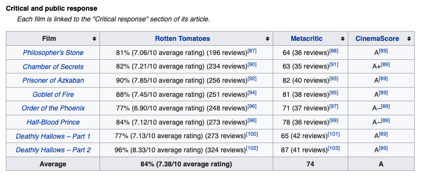
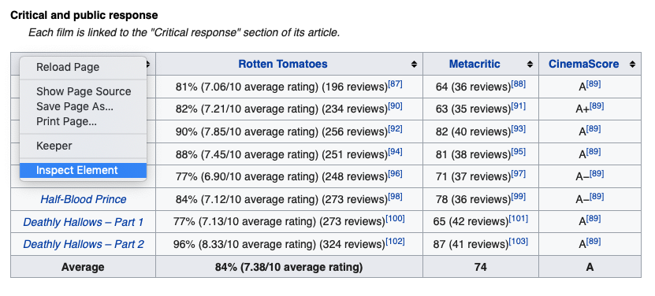
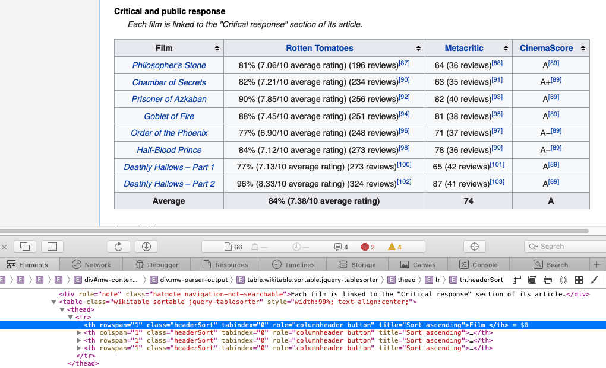
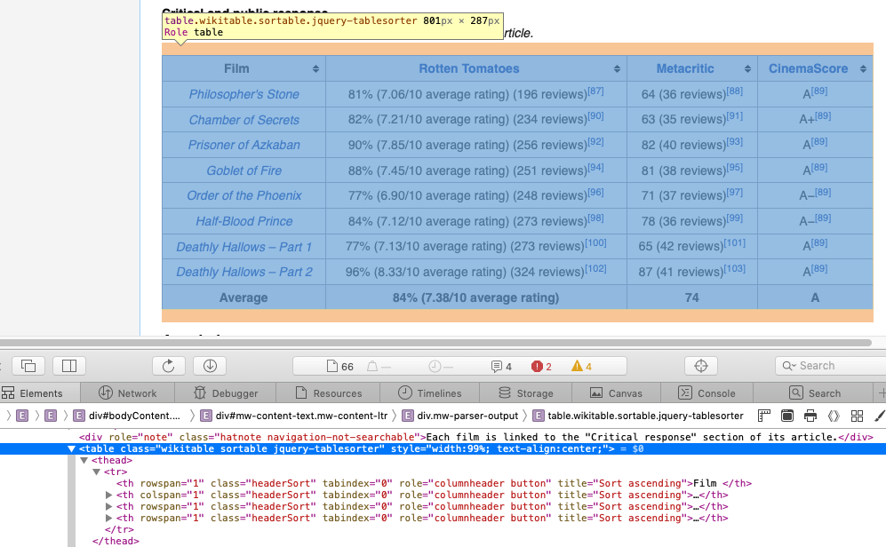
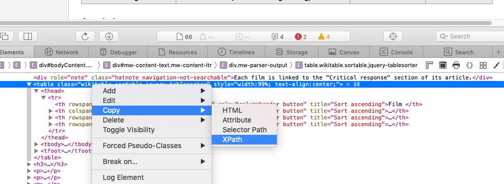

# Scrape data from the web {#web-scraping}

<!--[Link to original content](https://stat545.com/webdata03_activity.html)-->

What if data is present on a website but isn’t accessible through an API? We can still get that data, we just need to do some [web scraping][wiki-web-scraping]. 

There are three main steps to web scraping:

1. __Download__ the web page(s) as html files - download the raw html for however many pages you are interested in
2. __Locate__ the information you're interested in - find *where* in the html file the data you want is 
3. __Extract__ the information you're interested in - pull out the data

The [`rvest`][rvest-web] package (on [CRAN][rvest-cran], on [GitHub][rvest-github]) is a fantastic tool for web scraping in R. There are three main functions from `rvest` that we will use to get data from Wikipedia:

* `read_html()` - a function imported from the `xml2` package that creates an html document from a url (step 1 of our web scraping process). 
* `html_nodes()` and `html_node()` - we'll use this to extract the information that we're interested in (step 3). `html_nodes()` will extract multiple elements and return then in a list while `html_node()` will always only extract one element.
* `html_table()` - we'll use this to transform the extracted information into a data frame. 

But how are we going to do step 2, locate the information we're interested in? We can do this step by passing `html_node()` either a [CSS selector][wiki-css-selector], `css`, or an [XPath][wiki-xpath], `xpath`. Both XPath and CSS selectors tell `html_node()` where in the raw html the information it should extract is located. 

We will use XPath in the next section when we walk through an example of web scraping. If you want to know more about CSS selectors, the [Select nodes from an HTML document](http://rvest.tidyverse.org/reference/html_nodes.html#css-selector-support) `rvest` vignette is a good place to start. If you're new to CSS, this [website](http://flukeout.github.io) is a fun CSS tutorial.  

One final (but very important) note. If you decide to do some web scraping, be sure that you are web scraping responsibly and respectfully. Requesting a large quantity of content from a website can overload the server and potentially ruin the day of the server maintainer. Here are some resources to learn more about web scraping responsibly: 

* https://github.com/ropensci/robotstxt
* https://rud.is/b/2017/09/19/pirating-web-content-responsibly-with-r/


## Scraping Harry Potter Film Ratings {#harry-potter}

<!--Do I need to have a couple sentences talking about what Harry Potter is?-->

Let's practice web scraping by scraping [this table](https://en.wikipedia.org/wiki/Harry_Potter_(film_series)#Critical_and_public_response) of ratings from the wikipedia page for the Harry Potter Film series. Our end goal is to turn this table into a data frame in R and then plot the ratings each film received on Rotten Tomatoes.

[](./img/harry-potter-table.png)


First, install/load the `rvest` package.

```{r message = FALSE}
#install.packages("rvest")
library(rvest)
```

We will use [`read_html()`](http://rvest.tidyverse.org/reference/html.html) to download the html page. It takes one argument, `x`, which in our case will be the wikipedia URL for the Harry Potter film series as a string.

```{r}
url <- "https://en.wikipedia.org/wiki/Harry_Potter_(film_series)"
html_page <- read_html(url)
```

Next, we will use `html_node()` to extract the information we want, which in this case is the [ratings table](https://en.wikipedia.org/wiki/Harry_Potter_(film_series)#Critical_and_public_response). It takes two arguments: `x`, an html_document, and `css` or `xpath`, the CSS selector or XPath that it should use to find the information. We already have `html_page` to use for `x` so all we have left is to get either `css` or `xpath`. We will be using XPath for this example. 

To get the XPath for the table, visit the [webpage](https://en.wikipedia.org/wiki/Harry_Potter_(film_series)) Harry Potter films series on Wikipedia and scroll down to the ratings table. Mouse over "Film" in the top right corner of the table, right click, (I'm using Safari), and select "Inspect Element".

[](./img/harry-potter-1.png)

This will open up the Web Inspector panel at the bottom of the page. When you mouse over a line of the raw html in the Web Inspector Panel the corresponding section in the rendered html (just the regular webpage) will be highlighted. When you click "Inspect Element" you should see something like this:

[](./img/harry-potter-2.png)

This isn't quite what we're looking for. We want to capture the entire table, not just the "Film" header. Move your mouse over the line that starts with `<table...` in the Web Inspector Panel. The whole ratings table should be highlighted now.

[](./img/harry-potter-3.png)

To get the XPath that refers to this line in the raw html, right click and select Copy -> XPath from the drop down menu. 

[](./img/harry-potter-4.png)

Now, come back to R and save the XPath as `ratings_xpath`. Surround it with single quotes (not double quotes!) to save it as a string. 

```{r}
ratings_xpath <- '//*[@id="mw-content-text"]/div/table[3]'
```

Let's try calling `html_node()` with our `html_page` and our new `ratings_xpath`.

```{r}
ratings_node <- html_node(x = html_page, xpath = ratings_xpath)
ratings_node
```

What we get back is an XML node, which contains the html ratings table that our `ratings_xpath` refers to. To get this into a format that we're more comfortable with we can use [`html_table()`](http://rvest.tidyverse.org/reference/html_table.html) from `rvest`. It takes one argument, `x`, which will be our XML node. 

```{r}
ratings_df <- html_table(ratings_node)
```

```{r message = FALSE}
library(dplyr)
glimpse(ratings_df)
```

We successfully scraped the ratings table!

Let's make a plot of the ratings each film got on Rotten Tomatoes. We need to do some data wrangling to extract the number part of the percentage in the `Rotten Tomatoes` column first. 

We can use the [`str_extract()`](https://www.rdocumentation.org/packages/stringr/versions/1.4.0/topics/str_extract) function from [`stringr`][stringr-web]. Take a look at the documentation for `str_extract()` [here](https://www.rdocumentation.org/packages/stringr/versions/1.4.0/topics/str_extract). It takes two arguments, `string` and `pattern`, and returns the part of `string` that matches `pattern`. For the `pattern` we will use the regular expression, `[:digit:]{2}`, which translates to "exactly two digits". 

Once we've isolated the number part of the `Rotten Tomatoes` column we will convert it to a double with `as.double()`. 

```{r}
library(stringr)

rotten_tomatoes <- ratings_df %>% 
  select(Film, `Rotten Tomatoes`) %>% 
  mutate(`Rotten Tomatoes` = str_extract(string = `Rotten Tomatoes`, 
                                         pattern = "[:digit:]{2}"),
         `Rotten Tomatoes` = as.double(`Rotten Tomatoes`))

glimpse(rotten_tomatoes)
```

Looks good! There is one last data wrangling step that we need to do before making the plot. Let's remove the row where `Film` is "Average" and change the column to an ordered factor by using `factor()`. We want it to be an *ordered* factor so the films appear in chronological order rather than alphabetical order when we make out plot. To create an ordered factor, we can pass a vector to the `levels` argument in `factor()`.


First, let's remove the row where the value of `Film` is "Average"
```{r}
rotten_tomatoes <- rotten_tomatoes %>% 
  filter(Film != "Average")
```

Next, let's create a the vector of levels by using the [`pull()`](https://www.rdocumentation.org/packages/dplyr/versions/0.7.8/topics/pull) function from `dplyr`. It takes two arguments, a data frame and a column name, and returns the column as a vector. 

```{r}
film_levels <- rotten_tomatoes %>% 
  pull(Film)

film_levels 
```

The levels are already in the order that we want (chronological) so we don't need to change anything. Now, let's make `Film` a factor with the levels `film_levels`.

```{r}
rotten_tomatoes <- rotten_tomatoes %>% 
  mutate(Film = factor(x = Film, levels = film_levels))
```


Finally, let's plot the ratings for each film using `ggplot2`. 

```{r}
library(ggplot2)

ggplot(rotten_tomatoes, aes(Film, `Rotten Tomatoes`)) +
  geom_col(fill = "darkred") +
  labs(title = "Rotten Tomato Ratings of the Harry Potter Film Series",
       y = "Rating (%)", caption = "Data Source: Wikipedia") +
  # this changes the y axis limits to 0% to 100% 
  coord_cartesian(ylim = c(0, 100)) +
  # this angles the x axis labels
  theme(axis.text.x = element_text(angle = 45, hjust = 1))
```

Does this match up with how you would rate each film? If you want to keep going, try creating a plot for the `Metacritic` or `CinemaScore` ratings. 


```{r links, child="links.md"}
```
